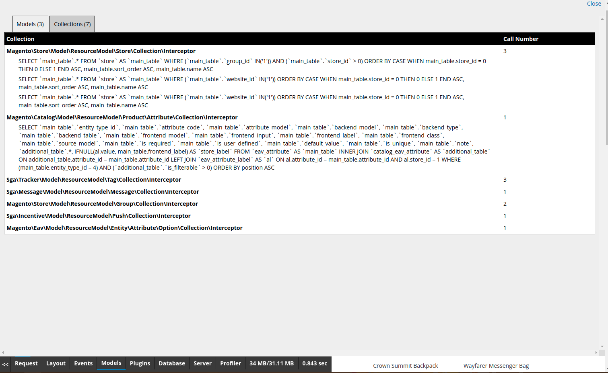
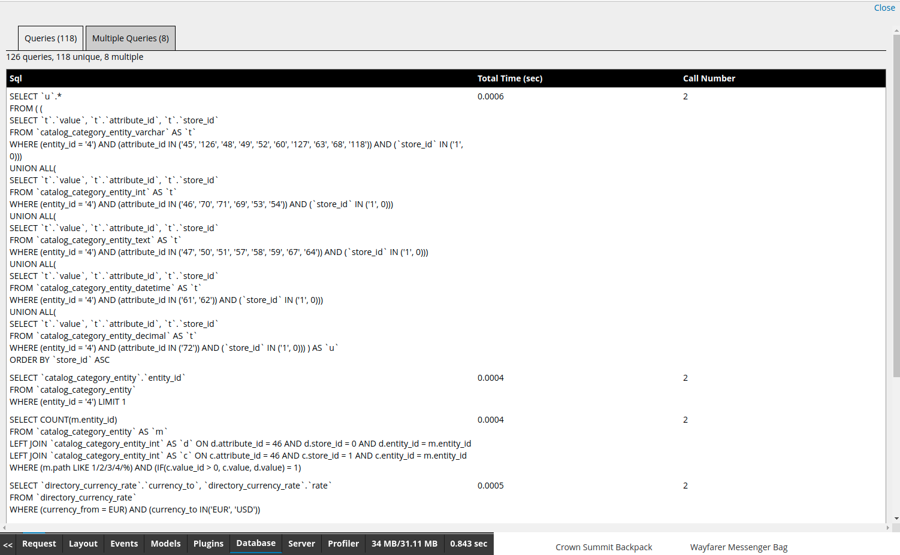

# m2-developertoolbar : documentation

## BO
La toolbar peut etre activé sur le front depuis la confid "Stores > Configuration > Advanced > Developer > Developer Toolbar > Enabled in FO"

## FO

### les differentes requetes

La toolbar attrape chaque requete entrante dans Magento.

Si la requete est affichable alors elle l'est, sinon elle est stockée en session et sera affichée la prochaine fois que la toolbar le sera.

Une requete est considéré comme non affichage si :
- c'est une requete AJAX
- la requete fini en redirection

### Show / Hide

le chevron a gauche de toolbar permet de l'afficher / masquer

### Les onglets
- Request : Données sur la requête
- Layout : Données sur le layout
- Events : Les Events / Observers
- Models : Les Models / Collections
- Plugins : La liste des plugins
- Database : Les requêtes sur la base de données
- Server : Info sur le serveur
- Profiler : Le profiler Magento
- Memory : Memoire utilisée / Memoire allouée
- Time : Temps de génération (hors Toolbar)

### Request

#### Request

#### Var GET / POST / COOKIE

### Layout

#### Tree Blocks

#### Blocks

Les blocs triés par odre de temps de génération

#### Handles

#### Xml

### Events

#### Events/Observers

Relation entre Event et Observer

#### Observers

Les observers triés par ordre de temps d'execution

### Models

#### Models

#### Collections

### Plugins

### Database

#### Queries

#### Multiple Queries

### Server

Le PhpInfo du server

### Profiler

